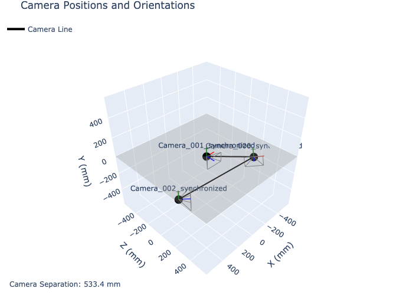

# Multi-Camera Calibration and Capture System

This directory contains tools for calibrating and capturing synchronized video from multiple cameras, which is essential for accurate 3D tracking of body movements.



## Directory Contents

- **capture.py**: Script for capturing calibration images from multiple cameras
- **calibrate.py**: Script for calibrating multiple cameras
- **bundle-calibrate.py**: Script for bundle adjustment calibration
- **checkerboard.yaml**: Checkerboard pattern configuration for calibration
- **output/**: Directory to store calibration results

## Prerequisites

For all scripts in this directory, you'll need:

```bash
pip install opencv-python numpy scipy
```

## Calibration Process Overview

The calibration process involves three main steps:

1. **Capture synchronized images** of a checkerboard pattern from all cameras
2. **Calibrate individual cameras** to determine their intrinsic parameters
3. **Calibrate camera pairs** to determine their relative positions (extrinsic parameters)

## Setup

1. Arrange your cameras in the desired configuration
2. Print a checkerboard pattern (default is 8x6 interior points)
3. Create a `calibration_images` directory

## Capturing Calibration Images

The `capture.py` script captures synchronized frames from multiple cameras when a checkerboard pattern is detected in all views.

```bash
python capture.py --camera_ids 0 1 2 --num_frames 30
```

- `--camera_ids`: List of camera indices to use (e.g., 0 1 2 for three cameras)
- `--num_frames`: Number of calibration frames to capture (default: 30)

### Usage Instructions

1. Run the script with the appropriate camera IDs
2. Position the checkerboard pattern so it's visible to all cameras
3. Press 's' to capture frames (the script will check for checkerboard patterns)
4. Press 'q' to quit

Images will be saved in the `calibration_images/` directory, organized by camera.

## Calibrating Cameras

The `calibrate.py` script calibrates individual cameras and computes the relative transformations between camera pairs.

```bash
python calibrate.py --image_dir calibration_images
```

- `--image_dir`: Directory containing calibration images (default: "calibration_images")

### Calibration Output

The calibration results will be saved to `output/calibration_results.json` and include:

- **Intrinsic parameters** for each camera (camera matrix, distortion coefficients)
- **Extrinsic parameters** for each camera pair (rotation, translation)
- **Reprojection errors** that indicate calibration quality

Example output in the terminal:

```
Camera 0 Intrinsics:
Focal Length (pixels): fx=951.8, fy=951.8
Principal Point: cx=639.5, cy=359.5
Skew: 0.000000
Field of View: 67.1° x 41.1°

Distortion Coefficients:
k1, k2, p1, p2, k3 = [0.04374 0.      0.      0.      0.     ]
Reprojection error: 0.123456 pixels

Stereo Transform - Reference Camera to Camera 1:
Rotation (degrees): [-0.22 -0.89  0.09]
Translation (mm): [450.2 -126.0 209.7]
Baseline distance: 513.2mm

Relative Position: Camera 1 is right (450.2mm) and up (126.0mm) and forward (209.7mm) from 0
```

## Bundle Adjustment Calibration

For more accurate calibration of 3+ cameras, use the `bundle-calibrate.py` script.

```bash
python bundle-calibrate.py --image_dir calibration_images
```

This script performs global optimization of all camera parameters simultaneously, which can improve accuracy for complex multi-camera setups.

## Visualizing the Calibration

After calibration, you can visualize your camera setup using the tools in the `utils/` directory:

```bash
python ../utils/calibration-plot.py ../utils/calibrations/calibration11.toml
```

## Troubleshooting

- **Poor calibration results**: Try capturing more calibration images with the checkerboard in different positions and orientations
- **Camera detection issues**: Use `../utils/camera-list.py` to verify available cameras
- **High reprojection error**: Consider using the bundle adjustment method for better results

## Best Practices

- Use a rigid checkerboard pattern (cardboard or mounted on a board)
- Ensure good, consistent lighting across all cameras
- Cover a wide range of positions and orientations with the checkerboard
- Aim for reprojection errors below 0.5 pixels for accurate tracking