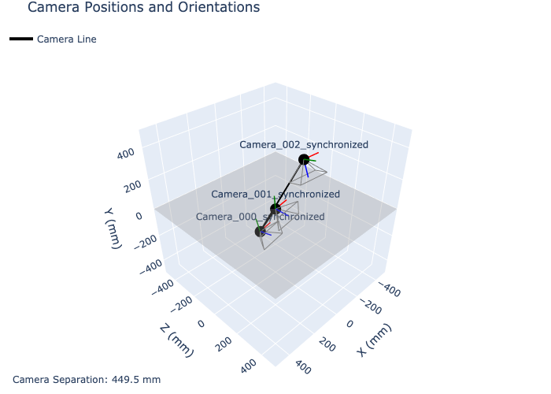
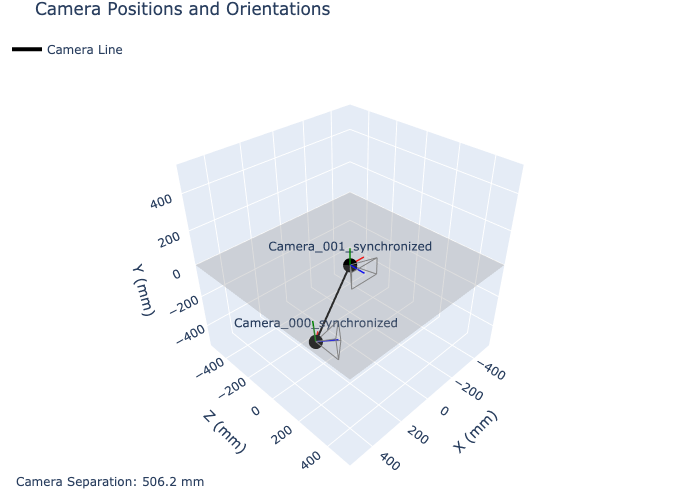
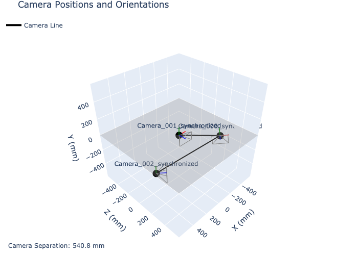

# Utilities

This directory contains utility scripts for camera management, visualization, and analysis of multi-camera setups.



## Directory Contents

- **calibration-plot.py**: Generates 3D visualizations of camera setups
- **camera-list.py**: Lists all available cameras on the system
- **interactive-plot.py**: Provides an interactive 3D visualization of camera setups
- **calibrations/**: Contains saved camera calibration parameters
- **camera_plots/**: Contains generated visualization images

## Camera Listing Utility

The `camera-list.py` script helps identify available cameras and their indices.

### Requirements

```bash
pip install opencv-python
```

### Usage

```bash
python camera-list.py
```

### Example Output

```
Available cameras:
Index 0: Camera 0
Index 1: Camera 1
Index 2: Camera 2
```

Use these indices when running other scripts that require camera IDs.

## Camera Calibration Visualization

The `calibration-plot.py` script generates a 3D visualization of camera positions based on calibration data.

### Requirements

```bash
pip install plotly numpy tomli scipy
```

If you're using Python 3.10 or earlier, you'll need to use `tomllib` instead of `tomli`:

```bash
pip install plotly numpy tomllib scipy
```

### Usage

```bash
python calibration-plot.py calibrations/calibration6.toml [reference_camera]
```

- `reference_camera`: Optional. The camera to use as reference (default: 'cam_0')

### Output

The script generates interactive 3D visualizations showing:

- Camera positions in 3D space
- Camera orientations (using frustums)
- Coordinate axes for each camera
- Ground plane grid

Example visualizations:


*Two camera calibration setup*


*Three camera calibration setup*

## Interactive Camera Visualization

The `interactive-plot.py` script provides an interactive Dash web application for exploring camera setups.

### Requirements

```bash
pip install plotly numpy tomli scipy dash
```

### Usage

```bash
python interactive-plot.py calibrations/calibration6.toml [reference_camera]
```

### Features

The interactive visualization allows you to:

- Adjust camera positions with sliders
- Rotate the ground plane
- View camera relationships from different angles
- Measure distances between cameras
- Reset transformations with a button

### Interactive Controls

The application provides controls for:

- **Translation sliders**: Adjust X, Y, Z position
- **Rotation sliders**: Adjust roll, pitch, yaw
- **Reset button**: Reset all transformations
- **3D viewer**: Interactive camera that can be rotated, zoomed, and panned

## Calibration Files

The `calibrations/` directory contains saved camera calibration parameters in TOML format.

### File Format

The TOML files have the following structure:

```toml
[cam_0]
name = "Camera_001_synchronized"
size = [ 1280, 720 ]
matrix = [ ... ]  # 3x3 camera intrinsic matrix
distortions = [ ... ]  # Distortion coefficients
rotation = [ ... ]  # Rotation vector
translation = [ ... ]  # Translation vector

[cam_1]
# Similar structure for camera 1

[metadata]
# Calibration metadata
```

These files can be generated from calibration results using the scripts in the `n-camera/` directory.

## Example Visualizations

The `camera_plots/` directory contains pre-generated visualizations:

- **calibration1_cameras.png**: Two camera setup
- **calibration6_cameras.png**: Three camera setup
- **calibration10_cameras.png**: Three camera setup with different positioning
- **calibration11_cameras.png**: Three camera setup with refined calibration

These images provide a quick reference for the camera arrangements used in different recordings.